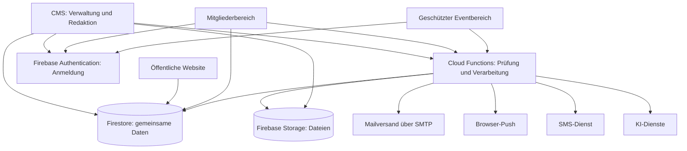
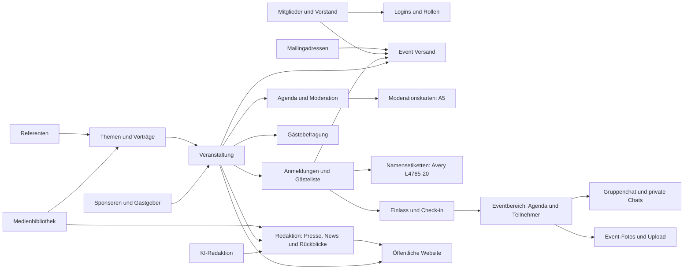
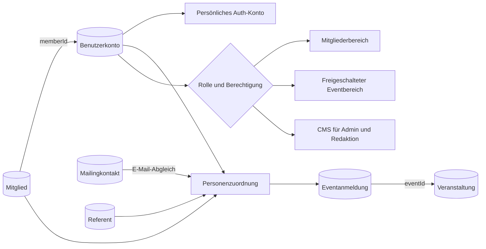
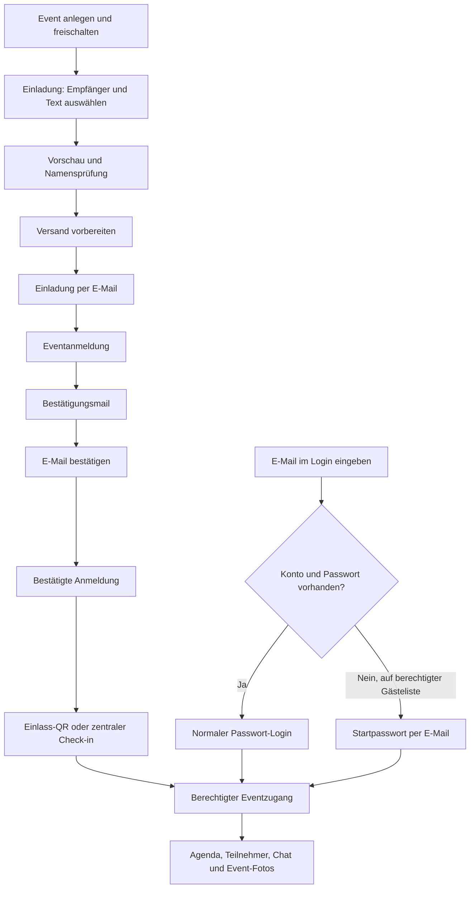
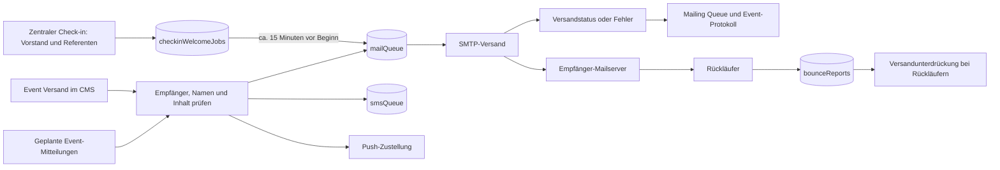

# PROdigitalTV – Verkettungsplan der CMS-Software

Stand: 2. Oktober 2026 · Aus dem aktuellen Quellcode abgeleitet.

Dieser Plan zeigt, welche Bereiche zusammenarbeiten, wo ihre Daten liegen und welche Aktionen daraus entstehen. Die Diagramme sind eine Übersicht der wichtigsten Verbindungen; sie bilden nicht jeden einzelnen Funktionsaufruf ab.

## 1. Gesamtübersicht

Direkte Daten- und Dateizugriffe werden durch Firestore- und Storage-Regeln geschützt. Cloud Functions prüfen zusätzlich Rollen, Eventberechtigungen und Eingabedaten. Website, CMS und Portal verwenden gemeinsame Datensätze.

## 2. Fachliche Verknüpfung der CMS-Bereiche

Die Agenda wird im Event gepflegt. Moderationskarten verwenden diese Daten und speichern bearbeitete Karten im Event. Namensetiketten verwenden die vorhandenen Anmeldedaten, keine eigene Teilnehmerdatenbank.

## 3. Personen und Konten: Was gehört zusammen?

| Datensatz | Bedeutung | Verbindung |
|---|---|---|
| `members` | Mitglied bzw. Mitgliedsunternehmen mit Ansprechpersonen | Benutzerkonto kann über `memberId` zugeordnet werden |
| `users` | Persönliches Login, Rolle und Kontostatus | Mit Firebase-Auth-Konto verbunden; Mitglieds- oder Eventzugang |
| `contacts` | Mailingkontakt mit E-Mail und Personendaten | Wird für Empfängerauswahl und persönliche Ansprache verwendet |
| `registrations` | Anmeldung einer Person zu einer bestimmten Veranstaltung | `eventId` verbindet die Anmeldung mit dem Event |
| `speakers` | Referentenprofil mit Funktion, Unternehmen und Vita | Verknüpft mit Events und Themen/Vorträgen |
| `boardMembers` | Vorstandsdaten | Verwendet für Darstellung und zentralen Gruppen-Check-in |

**Wichtig:** Ein Mailingkontakt, ein Login oder eine Eventanmeldung begründet keine Mitgliedschaft. Ein Referent kann zugleich Mitglied sein. Reine Gäste- und Referentenzugänge stehen im Reiter „Eventzugänge“; Mitglieder- und Verwaltungskonten stehen unter „Logins & Rollen“.

Ein E-Mail-Abgleich verbindet Daten, macht sie aber nicht automatisch zu einem einzigen Datensatz. Falsche Stammdaten können daher eine falsche Anrede verursachen. Leere Login-Namensfelder dürfen bestehende Namen nicht überschreiben.

## 4. Einladung, Anmeldung und Eventzugang

Login und Check-in sind getrennte Zustände. Der serverseitige Berechtigungscheck entscheidet, welche Eventfunktionen geöffnet werden dürfen. Gäste bekommen Zugang zu ihrem freigeschalteten aktuellen Event. Ein vorhandenes Mitgliedskonto wird weiterverwendet.

## 5. Versandkette und Rückmeldungen

- Personalisierte Event-Mitteilungen werden gestoppt, wenn benötigte Namensfelder fehlen. Die Meldung nennt die betroffenen Empfänger.
- Testgruppen übernehmen ebenfalls die vorhandenen Namensdaten.
- Welcome-Mails für zentral eingecheckte Vorstandsmitglieder und Referenten werden etwa 15 Minuten vor Beginn freigegeben; bei späterem Check-in zeitnah.
- Die Event-Protokollübersicht verbindet Event-Mitteilungen mit automatischen Event-Mails aus `mailQueue`. Welcome-Mails erscheinen dort ab ihrer Versandfreigabe.
- „Gesendet“ bedeutet, dass der SMTP-Server die Mail angenommen hat. Das belegt keine Ablage im Posteingang; Spamfilter und Rückläufer liegen danach in der Zustellkette.

## 6. Wichtigste Datenspeicher

| Bereich | Daten |
|---|---|
| Veranstaltungsplanung | `events`, `topics`, `speakers`, `sponsors` |
| Personen und Rechte | `members`, `users`, `contacts`, `boardMembers` |
| Anmeldung und Einlass | `registrations`, `eventLiveAccess` |
| Eventkommunikation | `eventLiveConversations` mit Gruppen, privaten Threads und Nachrichten; `eventChatAttachments` |
| Teilnehmerfotos | `eventMedia` und Bilddateien in Storage |
| Redaktion und Medien | `editorialContent`, `media_assets`, `media_variants`, `galleries`, `galleryImages`, `memberDocuments` |
| Versand | `eventNotifications`, `mailQueue`, `smsQueue`, `checkinWelcomeJobs`, `bounceReports` |
| Befragung | `event_feedback`, `liveSurveys`, `liveSurveyResponses`, `liveSurveyInvites` |
| KI und Konfiguration | `aiDrafts`, `aiLogs`, `settings` und weitere fachbezogene Sammlungen |

## 7. Technische Zuordnung im Quellcode

| Baustein | Datei / Bereich | Aufgabe |
|---|---|---|
| Navigation und Interaktionen | `src/main.js` | Routing, Formulare, Dialoge, Aufruf der Dienste |
| CMS-Menü | `src/cms/cmsLayout.js` | Bereiche, Seitennavigation und Rahmen |
| CMS-Seiten | `src/cms/cmsPages.js` | Verwaltungsansichten und Listen |
| Datenzugriff | `src/firebase/dataService.js` | Lesen und Schreiben der gemeinsamen Daten |
| Anmeldung und Rollen | `src/firebase/authService.js` | Authentifizierung und Loginzustand |
| Eventanmeldung | `src/firebase/registrationService.js` | Anmeldung und Bestätigungsabläufe |
| Eventbereich | `src/firebase/eventLiveService.js`, `functions/eventLive*.js` | Eventzugang, Teilnehmer und Kommunikation |
| Fotos | `src/firebase/portalGalleryPhotoService.js` | Upload, Anzeige und Gelesen-Status |
| Versand | `src/firebase/notificationService.js`, `functions/index.js` | Vorschau, Empfängerauflösung und Mail-Queue |
| Welcome-Terminierung | `functions/checkinWelcomeSchedule.js` | Zeitgesteuerte Freigabe der Welcome-Mails |
| Rückläufer | `functions/bounceService.js`, `functions/mailingSuppression.js` | Rückläuferverarbeitung und Sperren |
| Moderationskarten / Etiketten | `src/utils/moderationCardPrint.js`, `src/utils/nameBadgePrint.js` | Vorschau, Druck und PDF |
| KI-Überarbeitung | `functions/openaiFunctions.js` | Serverseitige KI-Aufrufe, unter anderem Moderationstexte |
| Zugriffsschutz | `firestore.rules`, `storage.rules`, serverseitige Rollenprüfungen | Schutz der Daten und Dateien |
| Bereitstellung | `scripts/build.mjs`, `firebase.json` | Build und Firebase Hosting; Hosting leitet `/mail-api/` an den Mail-Service weiter |

## 8. Prüfpunkte bei Fehlern

1. **Falscher oder fehlender Name:** Mailingkontakt, Mitglied und Benutzerkonto vergleichen; danach Empfängerauflösung und Vorlagenfelder prüfen.
2. **Kein Eventzugang:** Loginrolle, Freischaltung, Eventstatus und passende Registrierung prüfen.
3. **Mail fehlt:** `mailQueue`, geplanten Versand, Fehlermeldungen, Rückläufer und Spamordner prüfen.
4. **Fotos fehlen:** Eventzuordnung, Berechtigung, Metadatensatz in `eventMedia` und Datei in Storage prüfen.
5. **Falsche Agenda oder Karten:** Verknüpfung von Event, Programmpunkt, Vortrag und Referenten sowie gespeicherte Karten prüfen.

Quelle: Aktuelle CMS-Navigation, Client-Dienste, Cloud Functions und Sicherheitsregeln im PROdigitalTV-Arbeitsverzeichnis. Keine Passwörter, Schlüssel oder personenbezogenen Beispieldaten enthalten.
