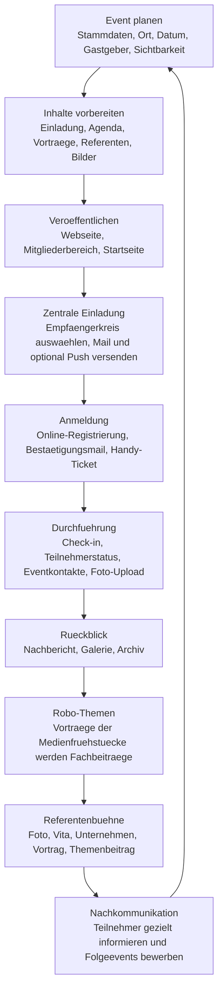
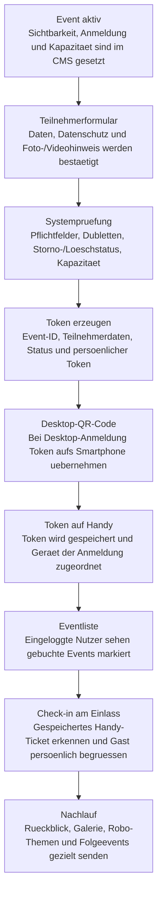

# PROdigitalTV Funktionsbeschreibung

Stand: August 2026

Diese Beschreibung fasst die wichtigsten Funktionen der PROdigitalTV-Webseite und des CMS zusammen. Sie ist so geschrieben, dass Redaktion, Administration und Vorstand schnell verstehen, wofuer ein Bereich gedacht ist, wie er genutzt wird und welche Wirkung er auf der Webseite hat.

## Highlights der Plattform

PROdigitalTV verbindet Webseite, CMS, Events, Redaktion, Mitgliederbereich und Medienverwaltung in einem System.

- Events koennen vollstaendig geplant, beworben, verwaltet und nachbereitet werden.
- Teilnehmer melden sich online an und nutzen ihr Handy als Ticket.
- Nach Veranstaltungen koennen Teilnehmer gezielt mit Rueckblicken, Galerien, Themenbeitraegen und Folgeevents informiert werden.
- Robo-Themen machen Vortraege der Medienfruehstuecke dauerhaft sichtbar.
- Referenten bekommen eine eigene Buehne mit Foto, Vita, Vortrag und Fachbeitrag.
- News und Morning Briefings koennen redaktionell gepflegt und veroeffentlicht werden.
- KI ersetzt nicht die Redaktion, sondern unterstuetzt bei Formulierung, Rechtschreibung, Struktur und Artikelbildern.
- Bilder werden hochgeladen, gecroppt, optimiert und als WebP-Varianten bereitgestellt.
- Audiofassungen mit Mitlese- und Karaokefunktion machen Beitraege besser nutzbar.
- Mitglieder erhalten einen geschuetzten Bereich fuer Events, Dokumente, Verzeichnis und Profil.
- Das CMS prueft fehlende Bilder, Texte, Links und andere Qualitaetsprobleme.
- Startseite, Events, Themen, News und Referenten lassen sich gezielt steuern.

## Flussdiagramm

Der Ablauf zeigt, wie aus einem Event ein vollstaendiger redaktioneller Kommunikationskreislauf entsteht.

## 1. Grundidee der Plattform

PROdigitalTV ist eine redaktionelle Webseite und ein Verwaltungswerkzeug fuer den Verein PROdigitalTV. Die Plattform verbindet oeffentliche Inhalte, Eventkommunikation, Mitgliederinformationen, redaktionelle News, Rueckblicke, Themenbeitraege und interne Verwaltungsfunktionen.

Die Plattform ist als mobile-first Web-App gedacht. Besucher, Mitglieder und Eventteilnehmer sollen die wichtigsten Funktionen zuerst auf dem Smartphone nutzen koennen: Events ansehen, sich anmelden, Handy-Ticket oeffnen, Mitgliederbereich nutzen, News lesen, Themen entdecken und Inhalte teilen.

Ergaenzend gibt es eine Desktop-Variante fuer umfangreichere redaktionelle und administrative Arbeit. Das CMS ist bewusst fuer groessere Bildschirme ausgelegt, weil Eventplanung, Medienbearbeitung, Teilnehmerverwaltung, Galeriepflege, Redaktion und Qualitaetssicherung mehr Platz und Praezision brauchen.

Die Webseite ist fuer Besucher, Mitglieder und Eventteilnehmer gedacht. Das CMS ist fuer Redaktion und Administration gedacht. Inhalte werden im CMS gepflegt und erscheinen je nach Status, Sichtbarkeit und Datum auf der oeffentlichen Webseite oder im geschuetzten Mitgliederbereich.

Die Plattform arbeitet mit folgenden Hauptbereichen:

- oeffentliche Webseite
- Eventverwaltung
- Anmeldesystem
- Themen und Vortraege
- Referentenverwaltung
- News und redaktionelle Beitraege
- Medienverwaltung
- Mitgliederbereich
- Mailverwaltung
- KI-Redaktion
- Qualitaetssicherung

## 2. Oeffentliche Webseite

Die oeffentliche Webseite zeigt die freigegebenen Inhalte fuer Besucher. Sie ist fuer Desktop und Mobile optimiert und enthaelt eine obere Navigation sowie auf Mobilgeraeten eine feste Button-Navigation.

### Startseite

Die Startseite gibt einen schnellen Ueberblick ueber aktuelle Inhalte. Sie zeigt nur Inhalte, die aktiv, veroeffentlicht und fuer die Startseite freigegeben sind.

Funktionen:

- Anzeige kommender Events
- Anzeige ausgewaehlter Themen
- Anzeige ausgewaehlter Referenten
- Anzeige aktueller News
- Darstellung von Reihen wie Medienfruehstueck oder Von den Besten lernen
- Verlinkung zu Events, Themen, News und Mitgliederfunktionen

Besonderheit: Ein Event oder Beitrag muss nicht automatisch auf der Startseite erscheinen. Im CMS kann festgelegt werden, ob ein Inhalt auf der Startseite gezeigt werden soll.

### Events

Die Eventseite zeigt Veranstaltungen. Dabei wird zwischen oeffentlichen Events, Mitglieder-Events und Rueckblicken unterschieden.

Funktionen:

- Liste kommender Veranstaltungen
- Anzeige vergangener Veranstaltungen als Rueckblicke oder Archiv
- Eventdetailseite mit Beschreibung, Datum, Ort, Gastgebern, Partnern und Anmeldung
- Anzeige, ob ein eingeloggter Nutzer bereits angemeldet ist
- Zugriff auf Mitglieder-Events nach Login

Mitglieder-Events sollen fuer berechtigte eingeloggte Mitglieder sichtbar bleiben, auch wenn sie nicht oeffentlich beworben werden.

### Themen

Die Themenseite zeigt redaktionelle Themenbeitraege. Die Robo-Themen sind dabei den Vortraegen der Medienfruehstuecke vorbehalten: Sie sollen nicht als allgemeiner Newsbereich verstanden werden, sondern als redaktionelle Auswertung und dauerhafte Buehne fuer die fachlichen Impulse aus den Veranstaltungen.

Funktionen:

- Themenliste mit groesseren Vorschaubildern
- Nachladefunktion fuer weitere Themen
- Detailseite mit Titel, Bild, Einordnung und Artikeltext
- Anzeige verwandter Themen
- Verknuepfung mit Events und Referenten

Wichtig: Themenbeitraege zu Events erscheinen erst auf der Webseite, wenn das betreffende Event vorbei ist. So werden Vortragsinhalte nicht vor der Veranstaltung veroeffentlicht.

Die Referenten stehen dabei bewusst im Mittelpunkt. Zu jedem Vortrag soll nicht nur ein kurzer Inhalt erscheinen, sondern auch sichtbar werden, wer diesen Impuls gegeben hat. Die Plattform baut den Referenten damit eine eigene Buehne: mit Foto, Vita, Unternehmen, Funktion, Vortragstitel, Themenbeitrag und Verknuepfung zum jeweiligen Event.

### Referenten

Die Referentenseite zeigt Personen, die mit Vortraegen oder Events verbunden sind.

Funktionen:

- Uebersicht der Referenten
- Referentenfotos
- Name, Unternehmen, Funktion
- Vita oder Kurzbeschreibung
- Verlinkung zu Themen und Vortraegen

Referenten koennen auf der Startseite erscheinen. Auf der Startseite werden nur eine begrenzte Anzahl Referenten gezeigt, damit die Seite schnell und uebersichtlich bleibt.

### News

Der Newsbereich zeigt redaktionelle Nachrichten, Branchen-News, Morning Briefings und weitere redaktionelle Inhalte.

Funktionen:

- Newsuebersicht
- Detailseiten fuer einzelne News
- Rubriken und Kategorien
- Vorschaubilder
- optional Audio
- Verlinkung zu Quellen oder weiterfuehrenden Inhalten

News aus dem KI-Newsimport sollen direkt im Newsbereich landen und als einzelne Beitraege erscheinen, nicht gesammelt als ein grosser Beitrag.

### Mitgliederbereich

Der Mitgliederbereich ist geschuetzt und nach Login erreichbar.

Funktionen:

- Mitglieder-Events
- Mitgliederinformationen
- Dokumente
- Mitgliederverzeichnis
- eigenes Profil
- Upload von Materialien

Auf Mobilgeraeten soll der Mitgliederbereich direkt nutzbar sein. Der CMS-Bereich bleibt mobil eingeschraenkt, der Mitgliederbereich dagegen gehoert zur Webseite und soll nach Login erreichbar sein.

## 3. CMS-Uebersicht

Das CMS ist die Verwaltungsoberflaeche fuer Inhalte, Events, Medien, Mitglieder, News und Systemfunktionen. Es ist primaer fuer Desktop vorgesehen.

Typische Grundfunktionen:

- Inhalte anlegen
- Inhalte bearbeiten
- Inhalte speichern
- Status setzen
- Sichtbarkeit steuern
- Bilder hochladen und zuordnen
- Vorschau oeffnen
- Inhalte veroeffentlichen
- Inhalte archivieren
- geloeschte oder fehlerhafte Eintraege pruefen

Status und Sichtbarkeit sind zentral:

- Entwurf: Inhalt ist noch nicht oeffentlich.
- Aktiv/Veroeffentlicht: Inhalt darf angezeigt werden.
- Archiviert: Inhalt bleibt gespeichert, wird aber nicht wie aktiver Inhalt behandelt.
- Oeffentlich: Inhalt ist fuer alle sichtbar.
- Mitglieder: Inhalt ist nur fuer eingeloggte Mitglieder sichtbar.
- Intern: Inhalt ist nur fuer CMS/interne Nutzung gedacht.

## 4. Eventverwaltung

Die Eventverwaltung ist einer der wichtigsten CMS-Bereiche. Ein Event besteht aus Stammdaten, Einladung, Vortraegen, Referenten, Anmeldung, Rueckblick und Medien.

### Stammdaten

Hier werden die Grundinformationen eines Events gepflegt.

Funktionen:

- Titel
- Datum und Uhrzeit
- Ort
- Eventtyp
- Gastgeber
- Partner
- Eventbild
- Status
- Sichtbarkeit
- Startseiten-Schalter
- Mitglieder-Schalter

Der Aktiv-Schalter soll das Event mit moeglichst wenigen Entscheidungen sichtbar machen. Zusaetzlich kann festgelegt werden, ob das Event auf der Startseite erscheinen soll.

### Einladung

Der Einladungsbereich enthaelt die redaktionellen Texte fuer die Eventankuendigung.

Funktionen:

- Teaser
- Beschreibung
- Einladungstext
- Hinweise fuer Teilnehmer
- Vorschau der Eventseite

Save-the-Date- oder Vorschau-Links muessen immer zur passenden Eventseite fuehren, auch wenn es sich um Mitglieder-Events handelt.

### Vortraege und Referenten

Dieser Bereich verwaltet die Agenda eines Events.

Funktionen:

- Vortrag anlegen
- Vortrag bearbeiten
- Titel, Kurztext und Langtext pflegen
- Referenten zuordnen
- Unternehmen und Logos anzeigen
- Reihenfolge per Drag-and-drop aendern
- automatische Neunummerierung nach dem Verschieben
- Vortragsbild hochladen
- Referentenfoto hochladen
- Bilder aus Mediathek laden
- Bilder loeschen

Vortraege koennen mehrere Referenten haben. In Listen und auf der Startseite wird bei Bedarf nur ein Referent stellvertretend gezeigt, damit die Darstellung uebersichtlich bleibt.

### Anmeldung

Der Anmeldebereich steuert das Event-Registrierungssystem.

Funktionen:

- Anmeldung aktivieren oder deaktivieren
- Teilnehmer manuell hinzufuegen
- Teilnehmer bearbeiten
- Teilnehmer loeschen
- Warteliste
- Check-in
- Stornierung
- Bestaetigungsmails
- Erinnerungsmails
- Push-Erinnerungen

Wenn eine Person manuell hinzugefuegt wird, soll sie ebenfalls eine Bestaetigungsmail erhalten und sich bei Bedarf aktivieren koennen.

Beim Loeschen kompletter Datensaetze fragt das CMS zur Sicherheit nach. So sollen versehentliche Datenverluste vermieden werden.

### Rueckblick

Nach dem Event kann ein Rueckblick erstellt werden.

Funktionen:

- Rueckblicktext
- Eventgalerie
- Nachbericht
- Verknuepfung mit News oder Pressebereich
- Uebernahme von Eventbildern
- Darstellung im Archiv
- gezielte Nachkommunikation an Teilnehmer

Rueckblicke erscheinen nicht als kommende Events, sondern im Rueckblick- oder Archivkontext.

Ein wichtiger Nutzen des Eventsystems ist die Kommunikation nach der Veranstaltung. Teilnehmer koennen nach dem Event gezielt informiert werden, zum Beispiel mit Rueckblick, Bildergalerie, weiterfuehrenden Themenbeitraegen, Links zu Referentenprofilen oder Hinweisen auf kommende Veranstaltungen. Dadurch wird aus einer einzelnen Veranstaltung ein laenger nutzbarer Kommunikations- und Marketinganlass.

### Fotogalerie und Downloads

Dieser Bereich sammelt Medien, die zu einem Event gehoeren.

Funktionen:

- Bilder hochladen
- Eventmedien verwalten
- Galerie zuordnen
- Downloads oder PDFs hinterlegen
- Bilder fuer Rueckblicke freigeben
- Foto-Upload fuer Mitglieder waehrend oder nach der Veranstaltung

Mitglieder koennen waehrend oder nach einer Veranstaltung Fotos hochladen. Diese Uploads landen nicht automatisch ungeprueft auf der Webseite, sondern dienen der Redaktion als Materialpool. Die Redaktion kann die Bilder sichten, freigeben, einer Galerie zuordnen, fuer Rueckblicke verwenden oder bei Bedarf aussortieren.

## 5. Bild- und Medienfunktionen

Die Medienverwaltung ist die zentrale Ablage fuer Bilder, Logos, Videos, Dokumente und Varianten.

### Bilder hochladen

Beim Upload soll das System die benoetigten Varianten automatisch erzeugen und richtig zuordnen.

Funktionen:

- Upload per Datei
- Upload direkt im Event-, Vortrag- oder Referentenformular
- Auswahl aus der Mediathek
- Loeschen einer Zuordnung
- automatisches Rendern als WebP
- Warnung bei zu kleiner Aufloesung
- Speicherung optimierter Varianten

Wenn ein Bild zu gross ist, wird es fuer die Webseite optimiert. Wenn ein Bild zu klein ist, zeigt das CMS einen Hinweis, dass es unscharf wirken kann.

### Cropping

Das Cropping erlaubt, einen Bildausschnitt bewusst festzulegen.

Funktionen:

- Bild im Rahmen verschieben
- mit Mausrad zoomen
- Bild vergroessern und verkleinern
- Ausschnitt uebernehmen
- getrennte Crops fuer unterschiedliche Nutzungen

Wichtig: Ein Referentenfoto und ein Vortragsbild brauchen unterschiedliche Formate. Ein Referentenfoto kann quadratisch oder portraitnah sein, waehrend ein Vortragsbild meist rechteckig ist. Der gewaehlte Ausschnitt soll gespeichert und spaeter genau so angezeigt werden.

### Bildvarianten

Die Plattform nutzt verschiedene Bildformate.

Typische Varianten:

- Eventbild: 16:9 oder breiter Header
- Themenbild: rechteckig fuer Liste und Detailseite
- Thumbnail: Vorschau fuer Listen
- Referentenfoto: Personenbild
- Logo: Unternehmens- oder Partnerlogo
- Social Share: Bild fuer Teilen/Vorschau
- Artikelbild: groessere redaktionelle Darstellung

Die richtige Variante ist wichtig, damit Bilder nicht abgeschnitten, unscharf oder falsch skaliert erscheinen.

### Videos

Videos werden zentral gepflegt und koennen mit Inhalten verbunden werden.

Funktionen:

- YouTube-URL oder Video-ID
- Vorschaubild
- Beschreibung
- Zuordnung zu Inhalt oder Event

## 6. Referentenverwaltung

Referenten koennen zentral und im Eventkontext gepflegt werden.

Funktionen:

- Name
- Unternehmen
- Funktion
- Foto
- Vita
- Kurzbeschreibung
- Zuordnung zu Vortraegen
- Anzeige auf Referentenseite
- Anzeige auf Themen- und Eventseiten

Die Vita ist wichtig fuer Profilseiten. Wenn Foto oder Vita fehlen, wirkt die Referentenseite unvollstaendig.

## 7. Themen- und Vortragsverwaltung

Themen sind redaktionelle Inhalte, die aus den Vortraegen der Medienfruehstuecke entstehen. Die Robo-Themen sind diesem Format vorbehalten und dienen dazu, die Vortraege nach dem Event redaktionell aufzubereiten, auffindbar zu machen und dauerhaft als Fachimpulse auf der Webseite zu zeigen.

Funktionen:

- Thema anlegen
- Thema bearbeiten
- Titel, Kurztext, Langtext
- Themenbild
- Referentenverknuepfung
- Eventverknuepfung
- Freigabe nach Eventdatum
- Anzeige in Themenliste
- Anzeige als verwandtes Thema

Vortragsbilder und Themenbilder muessen klar getrennt werden. Ein Vortrag kann ein Bild fuer die Agenda haben, waehrend das daraus entstehende Thema ein eigenes redaktionelles Bild oder Thumb braucht.

Die Themenfunktion ist zugleich eine Referentenbuehne. Referenten sollen nicht nur als kleine Namenszeile erscheinen, sondern als fachliche Koepfe des jeweiligen Themas: mit eigenem Foto, Vita, Unternehmen, Rolle und Verbindung zu ihrem Vortrag. Dadurch entsteht aus einem Eventvortrag ein eigenstaendiger, zitierbarer und teilbarer Fachbeitrag.

## 8. News und redaktionelle Inhalte

Der Newsbereich dient der redaktionellen Kommunikation.

Funktionen:

- News anlegen
- News bearbeiten
- News direkt veroeffentlichen
- Rubrik und Datum setzen
- Bild und Thumb hinterlegen
- optional Audio erzeugen
- Audioplayer mit Mitlese-/Karaokefunktion nutzen
- Quelle und Links pflegen
- KI-Import nutzen

News sollen nach dem Speichern direkt in der Newsverwaltung sichtbar sein und bei aktivem Status auf der Webseite erscheinen.

## 8.1 Redaktionelle Medienwerkzeuge

Die Redaktion kann Beitraege nicht nur als Text veroeffentlichen, sondern mit passenden Medien ergaenzen. Dadurch entstehen vollstaendige redaktionelle Artikelpakete fuer News, Themen, Rueckblicke, Mitgliederinformationen und Pressebeitraege.

Funktionen:

- Bilder und Thumbnails fuer Artikel erstellen oder hochladen
- automatische Thumbnail-Varianten fuer Listen, Karten und Detailseiten erzeugen
- Galerien mit mehreren Bildern einem Beitrag oder Event zuordnen
- PDFs oder Dokumente an redaktionelle Beitraege anhaengen
- Videos, zum Beispiel YouTube-Links, mit einem Beitrag verbinden
- Audiofassungen fuer Artikel erzeugen
- Audioplayer und Karaokefunktion fuer laengere Texte nutzen
- Medienstatus im CMS pruefen
- fehlende Bilder, Thumbnails, Videos oder PDFs in der Qualitaetssicherung erkennen

Galerien sind besonders fuer Rueckblicke wichtig. Sie erlauben, ein Event visuell nachzubereiten und Teilnehmern sowie Besuchern einen Eindruck der Veranstaltung zu geben.

PDFs koennen fuer Dokumente, Programme, Einladungen, Presseunterlagen oder Mitgliederinformationen genutzt werden. Videos ergaenzen Beitraege, wenn Mitschnitte, Interviews, Trailer oder externe Videoinhalte eingebunden werden sollen.

Die Thumbnail-Erstellung sorgt dafuer, dass redaktionelle Beitraege in Listen, auf der Startseite und in mobilen Ansichten professionell aussehen. Ein gutes Thumbnail ist dabei nicht nur ein verkleinertes Bild, sondern ein bewusst gesetzter Ausschnitt fuer die jeweilige Darstellung.

## 8.2 Audio-Erstellung und Karaokefunktion

Die Plattform kann redaktionelle Texte als hochwertige Audiofassung bereitstellen. Die Vorleser-Funktion nutzt sehr natuerlich klingende Sprachstimmen auf dem aktuellen Stand der Sprachtechnologie. Diese Funktion ist vor allem fuer News, Themenbeitraege, Rueckblicke und laengere redaktionelle Inhalte gedacht. Gleichzeitig ist die Vorleser-Funktion ein Beitrag zur Barrierefreiheit, weil Inhalte auch gehoert und nicht nur gelesen werden koennen.

Funktionen:

- Audiofassung aus einem Beitrag erzeugen
- natuerlich klingende Sprachstimmen fuer redaktionelle Beitraege nutzen
- Barrierefreiheit verbessern, weil Inhalte auch auditiv verfuegbar sind
- verschiedene Textgrundlagen nutzen, zum Beispiel Titel, Subline, Kurztext und Haupttext
- Audiostatus im CMS anzeigen
- Audio in Listen und Detailseiten verfuegbar machen
- Audioplayer auf der Webseite einblenden
- Mitlese- oder Karaokefunktion anzeigen
- aktuell gesprochenen Textabschnitt hervorheben
- Audio beim Seitenwechsel automatisch stoppen

Die Karaokefunktion hilft Nutzern, den gesprochenen Text mitzulesen. Dabei werden Textabschnitte synchron zum Audio hervorgehoben. Das macht laengere Beitraege leichter verstaendlich und verbessert die Nutzbarkeit auf Mobilgeraeten.

Im CMS sollte sichtbar sein, ob Audio bereits erzeugt wurde, ob eine barrierearme oder natuerliche Audiofassung vorhanden ist und ob noch ein Fehler oder eine offene Verarbeitung vorliegt.

## 9. KI-Redaktion und Morning Briefing

Die KI-Redaktion unterstuetzt beim Erstellen redaktioneller Inhalte.

Wichtig: Die KI-Unterstuetzung ersetzt nicht die Redaktion. Sie ergaenzt die redaktionelle Arbeit nur als Werkzeug fuer Formulierungsvorschlaege, Rechtschreib- und Stilpruefung, Strukturierung von Texten sowie die Erstellung oder Vorbereitung von Artikelbildern. Redaktionelle Auswahl, Bewertung, Freigabe, Quellenpruefung und Verantwortung bleiben immer beim Menschen.

Funktionen:

- Morning Briefing erzeugen
- KI-Newsimport
- einzelne News aus Importtexten trennen
- redaktionelle Texte formulieren
- Formulierungen verbessern
- Rechtschreibung und Stil pruefen
- Themenvorschlaege erzeugen
- Bildideen und Prompts erstellen
- Artikelbilder vorbereiten oder erzeugen
- Quellenhinweise sichern

Das Morning Briefing soll aktuelle Themen der deutschen Medienwirtschaft abbilden. Es soll nicht nur ein einzelnes Thema wie HbbTV behandeln, sondern mehrere relevante Entwicklungen, zum Beispiel KI, Arbeitsmarkt, Streaming, Regulierung, Plattformen, Werbung, Sportrechte und Produktion.

Bei Dateien mit mehreren News soll der Import die einzelnen Meldungen trennen und als mehrere einzelne Newsbeitraege anlegen.

## 10. Mitgliederverwaltung

Die Mitgliederverwaltung pflegt Mitgliedsunternehmen, Personen, Kontakte und Zugriffsrechte.

Funktionen:

- Mitglied anlegen
- Mitglied bearbeiten
- Logo und Beschreibung
- Kontaktdaten
- Ansprechpartner
- Mitgliedsstatus
- Profilfreigabe
- Portalzugriff
- Mitgliederverzeichnis
- Foto-Upload waehrend oder nach Veranstaltungen

Firmenmitglieder koennen mehrere Eventkontakte haben. Einzelmitglieder haben in der Regel einen Kontakt.

Im Mitgliederbereich kann ein Foto-Upload angeboten werden. Damit koennen Mitglieder waehrend einer Veranstaltung oder direkt danach Bilder an PROdigitalTV senden. Die Bilder werden als eingereichtes Material behandelt und erst nach redaktioneller Pruefung fuer Galerie, Rueckblick oder interne Dokumentation genutzt.

## 11. Mitgliedsantraege und Nutzer

Neue Mitgliedsantraege koennen im CMS verwaltet werden.

Funktionen:

- Antrag einsehen
- Kontaktdaten pruefen
- Status setzen
- Nutzerkonto verknuepfen
- Rollen vergeben

Rollen steuern, welche Bereiche ein Nutzer sehen darf.

Typische Rollen:

- Gast
- Mitglied
- Editor
- Admin

## 12. Mailverwaltung

Die Mailverwaltung ist die zentrale Steuerung fuer automatische und redaktionell vorbereitete E-Mails. Sie ist besonders wichtig fuer das Eventsystem, weil sie Teilnehmer, Mitglieder und Interessenten vor, waehrend und nach einer Veranstaltung begleitet.

Funktionen:

- Warteschlange fuer Mails
- Status versendet/fehlgeschlagen
- erste Einladung zu einer Veranstaltung aus dem CMS vorbereiten
- Empfaengerkreis gezielt auswaehlen, zum Beispiel gesamter Adressbestand oder nur Vereinsmitglieder
- weitere Zielgruppen wie Teilnehmer, Interessenten, Sponsoren, Partner oder manuelle Verteiler adressieren
- Eventbestaetigungen
- Stornierungen
- Einladungen
- Erinnerungen
- Mitgliedsantraege
- gezielte Nachfassmails nach Veranstaltungen
- Versandhistorie und Fehlerpruefung
- erneutes Anstossen fehlgeschlagener Mails
- Links zu Event, Storno, Ticket oder Mitgliederbereich
- Versand an einzelne Teilnehmer oder definierte Zielgruppen

Event-Bestaetigungsmails muessen Links enthalten, die zum konkreten Event fuehren. Bei Mitglieder-Events darf der Link nicht nur zur oeffentlichen Eventliste fuehren, sondern muss nach Login das richtige Event oeffnen.

Schon bei der ersten Einladung kann festgelegt werden, welcher Besucherkreis angesprochen werden soll. So kann ein Event breit an den gesamten Adressbestand kommuniziert werden oder bewusst nur an Vereinsmitglieder, bestimmte Teilnehmergruppen, Partner oder ausgewaehlte Kontakte gehen.

Nach einem Event kann die Mailverwaltung genutzt werden, um Teilnehmer gezielt erneut anzusprechen. Moegliche Inhalte sind Dankesmail, Rueckblick, Fotogalerie, weiterfuehrende Themenbeitraege, Referenteninformationen, Sponsorenhinweise oder Einladungen zu passenden Folgeformaten.

Die Mailingfunktion besteht aus mehreren Ebenen:

- Systemmails: automatische Bestaetigungen, Stornierungen, Aktivierungslinks und Erinnerungen.
- Eventmails: Einladungen, Save-the-Date, Anmeldebestaetigung, letzte Hinweise vor dem Event und Nachfassmails.
- Mitgliederkommunikation: Hinweise zu Mitglieder-Events, Dokumenten, internen Beitraegen oder Profilfunktionen.
- Redaktionelle Nachkommunikation: Rueckblick, Robo-Themen, Referentenbuehne, Galerien und Folgeevents.

Damit wird die Mailfunktion zu einem redaktionellen und organisatorischen Werkzeug. Sie sorgt nicht nur dafuer, dass Teilnehmer eine Bestaetigung bekommen, sondern hilft PROdigitalTV, Veranstaltungen ueber den eigentlichen Termin hinaus wirksam zu nutzen.

## 12.1 Push-Nachrichten

Ergaenzend zur E-Mail-Kommunikation kann die Plattform Push-Nachrichten fuer mobile Nutzer einsetzen. Push ist besonders sinnvoll fuer kurze, zeitnahe Hinweise rund um ein Event.

Funktionen:

- Teilnehmer koennen eine Event-Erinnerung auf dem eigenen Geraet aktivieren
- kurzfristige Hinweise vor oder waehrend einer Veranstaltung senden
- Erinnerungen an Beginn, Check-in, Ortsinformationen oder Programmupdates ausspielen
- mobile Nutzer direkt erreichen, ohne dass sie eine E-Mail oeffnen muessen
- Push als freiwillige Ergaenzung nutzen, falls Browser und Geraet dies unterstuetzen

Push-Nachrichten ersetzen keine E-Mail, sondern ergaenzen sie. E-Mail bleibt der verlaessliche Kommunikationskanal fuer Einladungen, Bestaetigungen und Nachfassmails. Push ist der schnelle mobile Kanal fuer aktuelle Hinweise.

## 13. Anmeldesystem

Das Anmeldesystem verwaltet Teilnehmerdaten fuer Events.

Funktionen:

- oeffentliche Anmeldung
- Mitgliederanmeldung
- manuelle Anmeldung im CMS
- E-Mail-Dublettenpruefung
- Datenschutz- und Foto-/Videohinweis
- Bestaetigungsmail
- Stornierungslink
- Check-in
- Anzeige des Anmeldestatus fuer eingeloggte Nutzer
- Anzeige des gebuchten Events auf der Eventseite
- Handy-Ticket fuer angemeldete Nutzer
- Aktivierungs- oder Bestaetigungslink per E-Mail
- Stornierung direkt ueber den persoenlichen Link

Wenn ein geloeschter Teilnehmer erneut dieselbe E-Mail nutzt, soll die Anmeldung moeglich sein, sofern der alte Datensatz wirklich geloescht, storniert oder inaktiv ist.

Die Anmeldung soll fuer Teilnehmer moeglichst einfach sein: Formular ausfuellen, Datenschutz- und Foto-/Videohinweis bestaetigen, absenden und danach eine Bestaetigung per E-Mail erhalten. Bei Mitglieder-Events fuehrt der Link nach Login direkt zum passenden Event, nicht nur zur allgemeinen Eventuebersicht.

Wenn ein Teilnehmer manuell im CMS eingetragen wird, soll das System ebenfalls eine Bestaetigungsmail verschicken. Dadurch bekommen auch manuell erfasste Personen denselben Informationsstand wie Personen, die sich selbst ueber die Webseite angemeldet haben.

Die Teilnehmerliste ist auch fuer die Zeit nach dem Event wertvoll. Sie ermoeglicht eine gezielte Nachbereitung: Teilnehmer koennen ueber neue Rueckblicke, Fotogalerien, Veroeffentlichungen der Vortraege, Robo-Themen, Referentenprofile oder thematisch passende Folgeevents informiert werden. Dadurch kann PROdigitalTV Veranstaltungen redaktionell verlaengern und relevante Angebote praeziser bewerben.

Technisch arbeitet das Handy-Ticket mit einem persoenlichen Token. Dieser Token ist eine eindeutige, schwer zu erratende Kennung, die mit genau einer Anmeldung und genau einem Event verbunden ist. Dadurch erkennt das System, zu welchem Gast, welchem Event und welchem Status ein Ticket gehoert.

Der QR-Code ist vor allem dann relevant, wenn sich ein Teilnehmer nicht direkt am Handy, sondern am Desktop anmeldet. Nach der Anmeldung erscheint auf dem Desktop ein QR-Code. Diesen scannt der Teilnehmer mit seinem Smartphone. Dadurch wird das persoenliche Handy-Ticket auf dem Mobilgeraet geoeffnet oder aktiviert.

Dabei wird der persoenliche Token auf dem betreffenden Handy gespeichert. Das ist wichtig, weil das System dieses Smartphone danach der richtigen Anmeldung zuordnen kann. Das Handy wird dadurch zum persoenlichen Tickettraeger fuer genau diesen Gast und genau dieses Event.

Der QR-Code ist also nicht das eigentliche Einlassticket auf dem Handy, sondern die technische Bruecke vom Desktop zum Smartphone. Nach dem Scan liegt der Token auf dem Handy. Dort sieht der Gast sein Event, seinen Status und die persoenlichen Ticketdaten.

Diese Loesung unterstuetzt eine professionelle Eventdurchfuehrung. Am Einlass kann das Team das Handy-Ticket pruefen und den Gast persoenlich auf dem Screen begruessen, zum Beispiel mit Name, Unternehmen und Eventstatus. Das beschleunigt den Check-in und macht den Empfang deutlich wertiger.

### Technischer Ablauf: Anmeldung und Handy-Ticket

## 14. Check-in und Tickets

Fuer Events kann ein Check-in genutzt werden.

Funktionen:

- Teilnehmerliste
- Status angemeldet
- Status eingecheckt
- mobile Ticketanzeige
- Handy als Ticket
- QR- oder Check-in-Ansicht
- Einlasskontrolle
- Ticketstatus in der Eventliste
- Anzeige von Warteliste, Bestaetigung offen oder Anmeldung aktiv

Wenn ein eingeloggter Nutzer ein Event gebucht hat, soll dies in der Eventliste sichtbar sein.

Das Handy-Ticket ersetzt eine separate Papierbestaetigung. Ein eingeloggter Teilnehmer kann auf dem Mobilgeraet sehen, dass er fuer ein Event angemeldet ist. Je nach Status wird angezeigt, ob das Ticket aktiv ist, ob die Bestaetigung noch offen ist oder ob die Person auf der Warteliste steht.

Beim Einlass kann das Team den Teilnehmerstatus pruefen und eine Person als eingecheckt markieren. Dadurch wird sichtbar, wer angemeldet war und wer tatsaechlich vor Ort teilgenommen hat.

## 15. Qualitaetssicherung

Die Qualitaetssicherung prueft Inhalte auf typische Fehler.

Funktionen:

- fehlende Bilder
- fehlende Alt-Texte
- fehlende Links
- fehlende Eventbilder
- fehlende Sponsorenlogos
- fehlerhafte Sichtbarkeit
- leere Galerien
- fehlende Video-Poster

Dieser Bereich hilft, vor Veroeffentlichung oder Deploy schnell zu sehen, wo noch etwas fehlt.

## 16. Navigation und Mobile Nutzung

Die Webseite ist mobile-first aufgebaut und hat zusaetzlich eine Desktop-Variante. Die mobile Web-App stellt schnelle Nutzung in den Vordergrund: Startseite, Events, Themen, News, Login, Mitgliederbereich, Handy-Ticket und Burger-Menue muessen auf dem Smartphone direkt erreichbar sein.

Die Desktop-Variante nutzt mehr Platz fuer Listen, Tabellen, Detailansichten, Medienverwaltung und das CMS. Sie eignet sich besonders fuer Redaktion, Eventorganisation und Administration.

Funktionen:

- obere Hauptnavigation
- Burger-Menue
- mobile Bottom-Navigation
- Link zu Referenten
- Login/Profil
- Events, Themen, News und Startseite
- mobile-first Darstellung fuer Besucher und Mitglieder
- Desktop-Ansichten fuer CMS und komplexe Verwaltung

Mobile Navigation muss schnell reagieren. Wenn ein Button gedrueckt wird, soll unmittelbar eine Lade- oder Zielreaktion sichtbar sein.

## 17. Deployment und Cache

Die Webseite wird als statischer Build auf Firebase Hosting deployt.

Funktionen:

- lokaler Build
- Firebase Hosting Deploy
- Cache-Buster ueber Versionsparameter
- Aktualisierung von CSS- und JS-Versionen
- produktiver Link ueber `prodigitaltv-da47b.web.app`

Nach einem Deploy kann der erste Aufruf laenger dauern, weil Browser, Service Worker oder Hosting-Cache neue Dateien laden. Danach sollte die Seite schneller reagieren.

## 18. Datensicherheit und Loeschschutz

Im CMS sollen kritische Aktionen bestaetigt werden.

Funktionen:

- Nachfrage beim Loeschen ganzer Datensaetze
- keine automatische Zerstoerung lokaler Arbeit
- sichere Speicherung vor GitHub-Push oder Deploy
- Backups in Dropbox moeglich
- GitHub als Versionssicherung

Besonders bei Events, Vortraegen, Referenten, Teilnehmern und News ist ein bestaetigter Loeschvorgang wichtig.

## 19. Typischer Arbeitsablauf fuer ein Event

1. Event im CMS anlegen.
2. Stammdaten, Datum, Ort und Gastgeber pflegen.
3. Eventbild hochladen oder aus der Mediathek auswaehlen.
4. Einladungstext schreiben.
5. Anmeldung aktivieren.
6. Vortraege und Referenten anlegen.
7. Referentenfotos, Logos und Vortragsbilder zuordnen.
8. Event aktivieren und entscheiden, ob es auf die Startseite soll.
9. Teilnehmer verwalten.
10. Nach dem Event Rueckblick, Galerie und Themenbeitraege veroeffentlichen.

## 20. Typischer Arbeitsablauf fuer News

1. News im CMS oder per KI-Newsimport erstellen.
2. Titel, Datum, Rubrik und Text pruefen.
3. Jede Meldung als eigenen Beitrag speichern.
4. Bild oder Thumb hinterlegen.
5. Status auf veroeffentlicht setzen.
6. Webseite pruefen.

## 21. Typischer Arbeitsablauf fuer Bilder

1. Bild hochladen.
2. Bei zu kleiner Aufloesung Warnung beachten.
3. Bild im passenden Crop-Rahmen ausrichten.
4. Ausschnitt uebernehmen.
5. System erzeugt WebP-Varianten.
6. Bild wird dem richtigen Feld zugeordnet.
7. Vorschau in Liste und Detailseite pruefen.

## 22. Wichtigste Regeln fuer die Redaktion

- Erst speichern, dann Vorschau pruefen.
- Bei Events immer Sichtbarkeit, Aktivstatus und Startseiten-Schalter pruefen.
- Bei Mitglieder-Events pruefen, ob der Inhalt fuer Mitglieder sichtbar ist.
- Bei Themen pruefen, ob das Event bereits vorbei ist.
- Bei Referenten immer Foto und Vita ergaenzen.
- Bei News jede Meldung einzeln veroeffentlichen.
- Bei Bildern auf richtiges Format und ausreichend Aufloesung achten.
- Vor Deploy einmal lokal pruefen.

## 23. Zielbild

Die Plattform soll fuer Besucher klar, schnell und redaktionell wirken. Fuer die Redaktion soll sie einfache Arbeitsablaeufe bieten: Bild anklicken, hochladen oder loeschen, speichern, fertig. Komplexe technische Aufgaben wie Bildvarianten, WebP-Optimierung, Zuordnung, Cache und Veroeffentlichungslogik sollen moeglichst automatisch im Hintergrund passieren.
